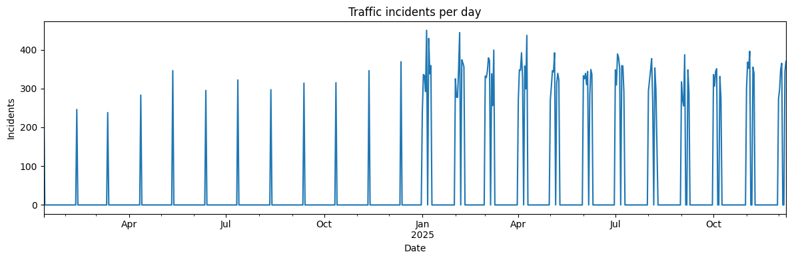
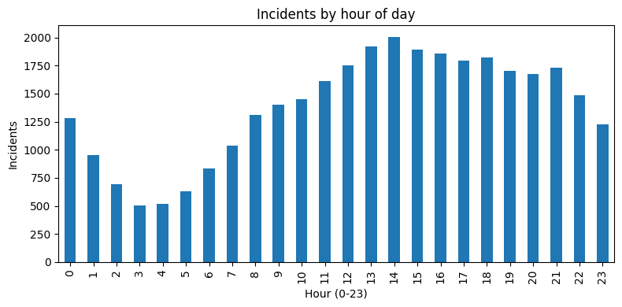
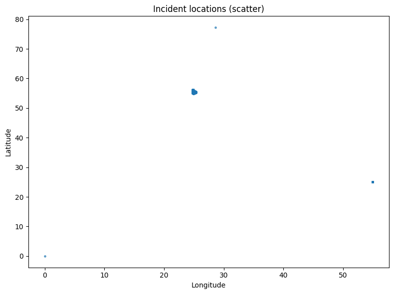

# 🚦 SmartTrafficPipeline


---

## 📊 Project Overview
The **Smart Traffic Data Pipeline** is an **end-to-end automated ETL workflow** that processes real-world traffic incident data.  

It:
- Extracts raw traffic data (`CSV` format).  
- Cleans, transforms, and summarizes it.  
- Generates **visual insights** (time trends, hotspots, severity).  
- Uploads processed data & visuals to **Google Drive**.  
- Sends **email alerts** automatically after each run. 

--- 

## 📂 Project Structure
SmartTrafficPipeline/
│
├── data/
│ ├── raw/ # Original input CSV files
│ │ └── traffic_incidents.csv
│ ├── processed/ # Cleaned & transformed datasets
│ │ └── traffic_clean.csv
│ └── summary/ # Reports & visualizations
│ ├── summary_YYYYMMDD.csv
│ ├── time_series.png
│ ├── hourly_trend.png
│ ├── top_locations.png
│ └── latlon_scatter.png
│
├── etl/ # ETL scripts
│ ├── extract.py
│ ├── transform.py
│ ├── load.py
│ ├── generate_visuals.py
│ └── utils.py
│
├── config.py # Config (email, drive auth, etc.)
├── pipeline.py # Main entrypoint (runs full ETL pipeline)
├── requirements.txt # Python dependencies
└── README.md # Project documentation

---

## 📂 Pipeline Output

### Example Visuals
Time series of incidents:  


Hourly traffic trends:  


Top 10 incident locations:  


Incident distribution (Lat/Lon scatter):  


---

## ⚡ Tech Stack
- **Python** (pandas, matplotlib, seaborn)  
- **Google Drive API** (for automated uploads)  
- **SMTP (Email Alerts)**  
- **Zip Archiving & File Management**  
- **ETL Workflow Automation** 
 
---

## ▶️ How to Run
1. **Clone the repository**
   ```bash
   git clone https://github.com/LingeswaranR-22/SmartTrafficPipeline.git
   cd SmartTrafficPipeline

2. **Create a virtual environment**
   ```bash
  python -m venv .venv
  .venv\Scripts\activate   # Windows

3. **Install dependencies**
   ```bash
<<<<<<< HEAD
   pip install -r requirements.txt

4. **Run the full Pipeline(ETL + summary + upload + email)**
   ```bash
   python pipeline.py

5. **(Optional) Run only the visualization generator**
    ```bash
   python etl/generate_visuals.py

---

## ✅ Features
- Automated ETL Pipeline (Extract → Transform → Load).
- Cleaned dataset saved as analytics-ready CSV.
- Automatic summary reports & visualizations.
- Files are archived and uploaded to Google Drive.
- Email notifications confirm successful runs.

---

## 📧 Email Alerts
After each successful pipeline run, you’ll receive:

- Processed dataset
- Summary report
- Key visuals (charts & graphs)

---
 
## 🚀 Future Enhancements
- Integration with real-time APIs for live traffic monitoring.
- Deployment using Airflow or Prefect for scheduling.
- Dashboard in Power BI / Streamlit for interactive analytics.

---

## 📜 License
This project is licensed under the MIT License.  

See the [LICENSE](LICENSE) file for more details.  

---

## 👤 Author
**Lingeswaran R**

Detail-oriented data engineer focused on building reproducible, automated analytics pipelines.
 
